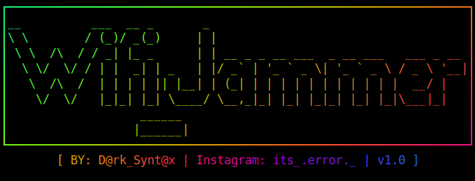

# Wifi-Jammer
<p align="left">
  <a></a>
 </p>
<p align="center">
  
</p>

<p align="center">
  Tool to Jam Full WiFi Network Near-You!
</p>
<p align="center">
  [ BY: D@rk_Synt@x | Instagram: its_.error._ | v1.0 ]
</p>

<p align="center">
  <a href="https://github.com/DarkSyntax7"></a>
  <a href="https://github.com/DarkSyntax7">.svg" ></a>
  <a href="https://github.com/DarkSyntax7"></a>
  <a href=""></a>
  <a href="https://github.com/DarkSyntax7"></a>
</p>

  ## DISCLAIMER
  
  <p align="center">
  TO BE USED FOR EDUCATIONAL PURPOSES ONLY
</p>

The use of the Wifi-Jammer is **COMPLETE
RESPONSIBILITY of the END-USER**. Developers assume NO liability and are NOT
responsible for any misuse or damage caused by this program. Also we inform you
that some of your your actions may be **ILLEGAL** and you **CAN NOT** use this
software to test person or company without **WRITTEN PERMISSION** from them.

# Tested On

<table>
    <tr>
        <th>Operative system</th>
        <th> Version </th>
    </tr>
    <tr>
        <td>Parrot OS</td>
        <td> Rolling Edition </td>
    </tr>
    <tr>
        <td>Kali linux</td>
        <td> Rolling Edition </td>
  </tr>
    <tr>
        <td>Ubuntu</td>
        <td>16.04  / 15.10 </td>
    </tr>
</table>

# FOUND A BUG ? / HAVE ANY ISSUE ? :- 

- You can open issues/bugs
- Check closed & solved issues/bugs before opening new.
- Do Not Spam or Advertise & Respect Everyone.

# Installation :

## Clone

```
git clone https://github.com/DarkSyntax7/Wifi-Jammer
```
## Running
- Dependencies will be automatically installed.
```
cd Wifi-Jammer && ls

sudo bash wifi-jammer.sh
```
# Demonstration
<iframe width="560" height="315" src="https://www.youtube.com/embed/faL-VvP2Kvc" frameborder="0" allow="accelerometer; autoplay; clipboard-write; encrypted-media; gyroscope; picture-in-picture" allowfullscreen></iframe>

# Contact:

- Instagram:(https://www.instagram.com/its_.error._/)
- E-Mail:(darksyntax7@protonmail.com)
- Github:(https://github.com/DarkSyntax7)
